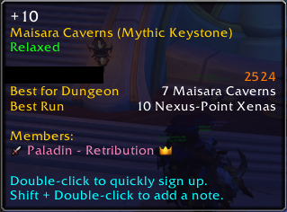

# SmartLFG
Auto-accept Group Finder role check and double-click to sign-up.

Install & forget. no settings needed, the add-on uses the role set on Group Finder (Dungeon Finder).

### Features

* Open the **Group Finder → Premade Groups** and **double-click** any listing.
* Auto-accepts the role check popup when a friend queues the group.
* Set your role: open the Group Finder (default key: `I`) and tick your role.
* Multilingual support: 🇬🇧 `English`, 🇩🇪 `German`, 🇫🇷 `French`, 🇪🇸 `Spanish`, 🇷🇺 `Russian`, 🇧🇷 `Portuguese (Brazil)`, 🇮🇹 `Italian`

### Commands

| Command                    |What it does                    |
|----------------------------|------------------------------- |
| <code>/slfg on\|off</code> |Turn the addon on or off        |
| <code>/slfg friends</code> |Toggle auto-accept from friends |
| <code>/slfg status</code>  |Show current settings           |
| <code>/slfg help</code>    |List all commands               |

***
Share any feedback, suggestions or bug reports [Github](https://github.com/akidrizi/smartlfg/issues) | [Curse](https://www.curseforge.com/wow/addons/smartlfg) | [Wago](https://addons.wago.io/addons/smartlfg).

I am working on **SmartLFG 2.0** with more new automations and better UI.

💬 Reach me on Discord: **@omorfoskitsos**
