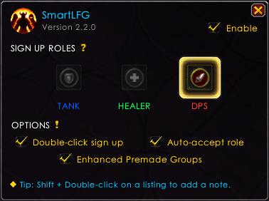

# SmartLFG
Stop clicking through menus — double-click any Premade listing and you're signed up. 
SmartLFG makes applying to groups instant, native, and effortless.

<p align="center">
  
</p>


### Features

* **Double-click** any listing to sign up instantly.
* **Shift + double-click** to open the application and add a note before submitting.
* **Auto-accept** the role check popup when the leader queues the group.
* **Enhanced Premade Groups:** create premade groups easier and faster with less clicks.
* **Conflict detection** if another add-on hijacks the Premade sign-up. Mouseover on exclamation mark (`!`) for details.
* **UI Skin support**: inherit your UI skin automatically whether you use EllesmereUI, ElvUI, AddOnSkins or Aurora. Nothing to configure, no dependency: with none of them installed the window keeps its normal look.
* Open **Options menu** from the minimap or with the command `/slfg` to: **choose role** & **toggle features**.
* Multilingual support: 🇬🇧 `English`, 🇩🇪 `German`, 🇫🇷 `French`, 🇪🇸 `Spanish`, 🇷🇺 `Russian`, 🇧🇷 `Portuguese (Brazil)`, 🇮🇹 `Italian`

### Commands

| Command                    | What it does                                    |
|----------------------------|-------------------------------------------------|
| <code>/slfg</code>         | Open the options panel (all help & config here) |
| <code>/slfg on\|off</code> | Turn the addon on or off                        |

`/smartlfg` is an alias for `/slfg`.

Check which skinning addon SmartLFG picked up (only one can skin the window at a time):

```
/run SmartLFG.Skin.GetProvider()
```

Or just **double-click the version number** in the options window — it reports the same thing.

***
Share any feedback, suggestions or bug reports [Github](https://github.com/akidrizi/smartlfg/issues) | [Curse](https://www.curseforge.com/wow/addons/smartlfg) | [Wago](https://addons.wago.io/addons/smartlfg).

💬 Reach me on Discord: **@omorfoskitsos**
