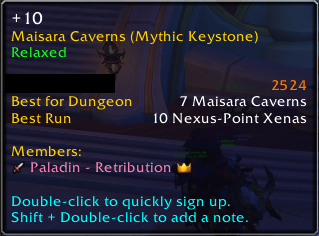

# SmartLFG
Stop clicking through menus — double-click any Premade listing and you're signed up. SmartLFG makes applying to groups instant, native, and effortless.

### Features

* Open the **Group Finder → Premade Groups** and **double-click** any listing to sign up instantly.
* **Shift + double-click** to open the application and add a note before submitting.
* Auto-accepts the role check popup when any leader queues the group.
* **Pick your role(s) in the options panel:** `/slfg` opens a multi-select role picker, limited to the roles your class can actually perform. Your selection maps to your native Group Finder roles, so the sign-up dialog inherits them automatically.
* Tooltip hint on listings you can sign up to.
* **Toggle features independently:** turn **Quick sign-up** (double-click, note, tooltip hint) and **Auto-accept role checks** on or off separately in `/slfg`.
* Multilingual support: 🇬🇧 `English`, 🇩🇪 `German`, 🇫🇷 `French`, 🇪🇸 `Spanish`, 🇷🇺 `Russian`, 🇧🇷 `Portuguese (Brazil)`, 🇮🇹 `Italian`

### Commands

| Command                    | What it does                                    |
|----------------------------|-------------------------------------------------|
| <code>/slfg</code>         | Open the options panel (all help & config here) |
| <code>/slfg on\|off</code> | Turn the addon on or off                        |

`/smartlfg` is an alias for `/slfg`.

### Changelog

**2.0.0**
- New in-game options panel: enable/disable and pick your sign-up role(s).
- Toggle **Quick sign-up** (double-click, Shift+note, tooltip hint) and **Auto-accept role checks** independently.
- Class-aware multi-role selection — choose any roles your class can perform.
- Double-click a Premade Groups listing to sign up; Shift + double-click to add a note.
- Auto-accept the role check when **any** leader queues the group (no longer limited to friends).
- Tooltip hint on listings you can sign up to.
- Simplified commands: `/slfg` opens the options panel, `/slfg on|off` toggles the addon.
- Major internal overhaul and cleanup; roles now use the native Group Finder role state.

See [CHANGELOG.md](CHANGELOG.md) for the full history.

***
Share any feedback, suggestions or bug reports [Github](https://github.com/akidrizi/smartlfg/issues) | [Curse](https://www.curseforge.com/wow/addons/smartlfg) | [Wago](https://addons.wago.io/addons/smartlfg).

💬 Reach me on Discord: **@omorfoskitsos**
